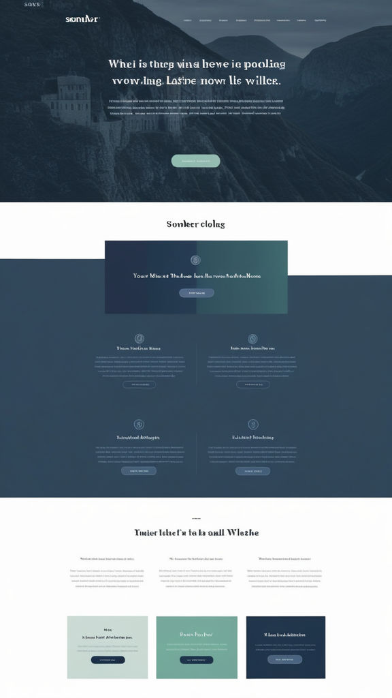

# App de trilhas na natureza

## Propósito

* Praticar React, Typescript, Tailwind
* Aumentar portfolio

## Inspiração para Layout

* Gerado por AI, prompt: "landing page, somber colors".

## Copy da página

* Gerado pelo ChatGPT

    Header
        Logo do Aplicativo

        Menu de Navegação: Home | Funcionalidades | Preços | Contato

    Hero Section
        ![Beautiful Nature Landscape Background Image]

        Título Chamativo: Explore a Natureza com Facilidade

        Subtítulo Explicativo: Planeje suas trilhas, descubra novos destinos e navegue offline com o nosso aplicativo.

        Botão de Chamada para Ação: Baixe Agora

    Sobre o Aplicativo
        Breve Descrição: Nosso aplicativo de trilha foi projetado para aventureiros de todos os níveis. Simplifique suas explorações com ferramentas de planejamento, mapas offline e sugestões de destinos deslumbrantes.

        ![Imagem do Aplicativo]

    Funcionalidades
        Planejamento de Rotas

        Crie e personalize suas trilhas com facilidade.
        ![Ícone de Planejamento de Rotas]
        Mapas Offline

        Navegue sem conexão com mapas detalhados.
        ![Ícone de Mapas Offline]
        Sugestões de Destinos

        Descubra novos locais incríveis para explorar.
        ![Ícone de Sugestões de Destinos]
        Monitoramento de Atividades

        Acompanhe seu progresso e compartilhe com amigos.
        ![Ícone de Monitoramento de Atividades]
        Comunidade de Trilheiros

        Conecte-se com outros entusiastas e troque dicas.
        ![Ícone de Comunidade]

    Depoimentos
        Depoimento 1:
        "Este aplicativo transformou minhas trilhas! As sugestões de rotas são incríveis e os mapas offline são super úteis." - Ana S.

        Depoimento 2:
        "A funcionalidade de planejamento de rotas é muito intuitiva. Recomendo a todos os trilheiros!" - Marcos L.

    Preços
        Plano Grátis

        Acesso básico ao planejamento de rotas e comunidade.
        ![Ícone Plano Grátis]

        Plano Pro

        Mapas offline e sugestões de destinos premium.
        ![Ícone Plano Pro]

        Plano Premium

        Todas as funcionalidades, monitoramento avançado e suporte prioritário.

        ![Ícone Plano Premium]

        Detalhes dos Benefícios:

        Plano Grátis: Acesso às funcionalidades básicas.
        Plano Pro: Mapas offline, sugestões premium e mais.
        Plano Premium: Todas as funcionalidades, monitoramento avançado e suporte prioritário.

    Botão de Chamada para Ação: Experimente Grátis

    Footer
        Links para Redes Sociais: [Facebook] [Twitter] [Instagram]

        Informações de Contato: contato@appdetrlha.com

        Links para Termos de Serviço e Política de Privacidade